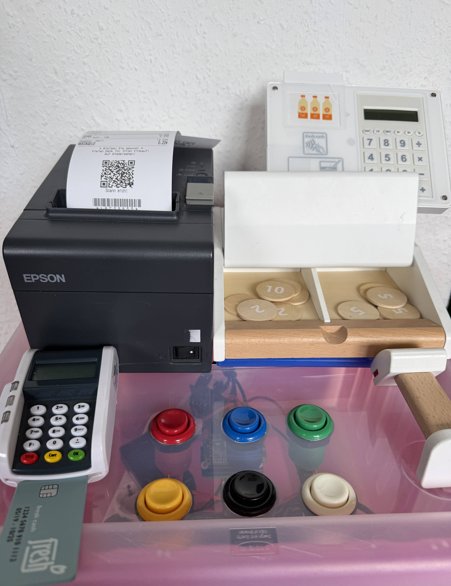
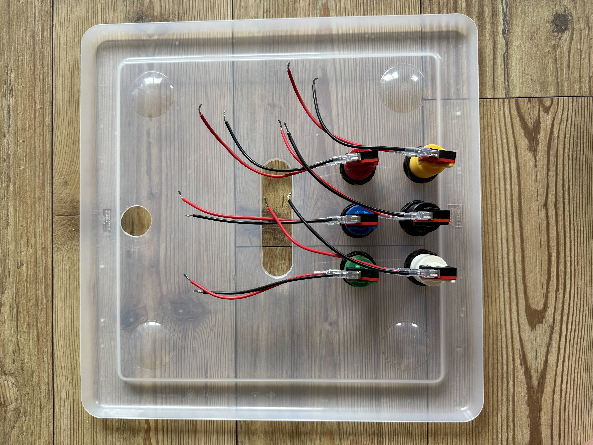
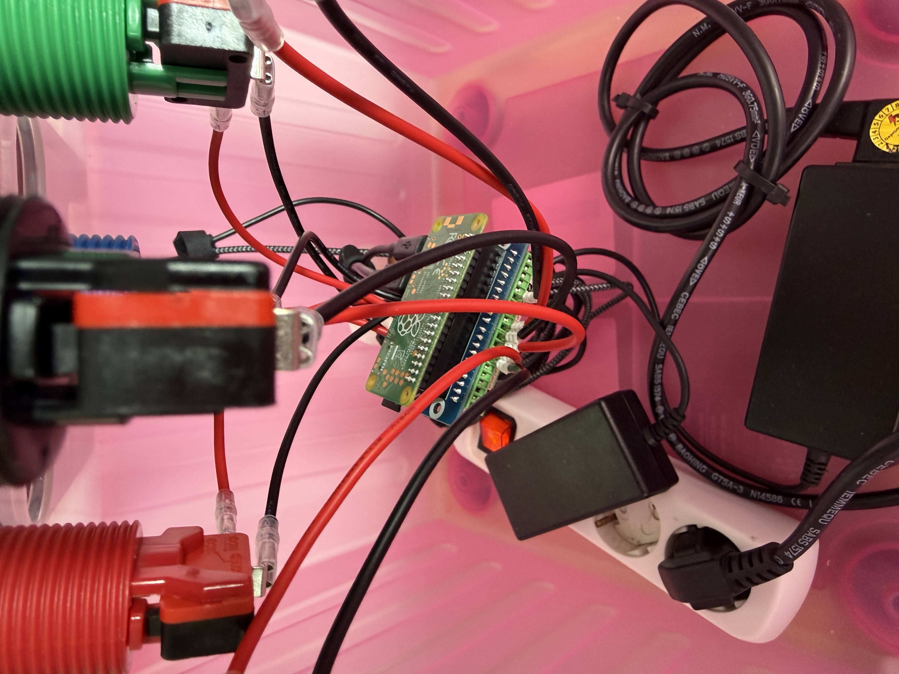

# Behind the Scenes: Building Le Petit Café

My kids play the same six games over and over: supermarket, ice cream café, restaurant, bus/taxi, cinema, table reservation. Every wooden or plastic toy till on the market covers maybe one of those, and none of them actually *do* anything. Press any button and nothing changes. So I built a mobile checkout system instead: six arcade buttons, a real thermal printer, and a Raspberry Pi Zero hidden inside a plastic storage box. Press a button and a genuine, randomly generated receipt rattles out, with different items, different prices, and a different name on it every time.

## The build

Wiring six arcade buttons into a Pi Zero sounds simple until you're actually holding a screwdriver over a terminal block the size of a stick of gum.

 

- Bought a crimp terminal kit sized for automotive connectors, only to discover the GPIO breakout board's screw terminals are spaced for something far finer. The fork terminals literally straddled two adjacent pins at once.
- Switched to wire ferrules instead, in the smallest size available, which turned out to match the board's official spec exactly.
- The terminal block's orientation isn't keyed at all: it plugs onto the Pi's header in either rotation. Only the pin labels printed on the block itself settled which way was correct.

## The QR code is really for the grown-ups

Every receipt ends with a QR code and a little "scan me!" prompt. None of my kids own a smartphone, so it's really not for them. It's for us, the parents, or whoever's visiting. Someone scans it, and only then do we find out whether this particular receipt hid a joke or an actual voucher (a scoop of ice cream, time with Mom, a bike ride, that kind of thing). The kid just watches the grown-up's face change and has to ask what it says.

## Real names, kept local

The staff names on the receipts, "Bedienung: ...", "Fahrer/in: ...", aren't hardcoded. They come from a small local config file that never leaves the device and isn't part of the public repo. Drop in your own kids' names and every receipt starts calling them by name. Small detail, but it's the difference between a receipt printer and our receipt printer.

## A secret handshake, just for me

Two of the six buttons double as a hidden combo. Hold two specific ones together for about a second and instead of the usual receipt, out comes a small "special order": a coffee, made just how I like it, addressed to my lovely wife, "from" one of the kids (picked at random, so it reads like they ordered it themselves). It's the same printer, same paper, same code, just repurposed for a second, private use on a machine that's supposedly all about pretend play.

## Why I actually built this

Before this, I'd never done anything like it. I have friends who are real engineers, and I deliberately didn't ask them for help. This was as much an experiment in how far you can actually get working with AI, alone, as it was a project for my kids. Every receipt generator, the wiring, the debugging: all of it happened working through it together with Claude, with nobody looking over my shoulder in person. It took longer than an engineer would have needed, and there were a few dead ends along the way.

But it works. My kids press a button and a real receipt comes out, every time, and it lights up their faces every time. It was a great experiment, and maybe it'll light up some kids' hearts on the other side of the world too, if you end up building your own version. I'd love to see what your kids' checkout looks like.

## First real print

📹 **[Watch the video](docs/behind-the-scenes/first-print.mp4)** (GitHub plays it inline once you click through)

## Try it yourself

- **Live demo:** https://nuenni.github.io/LePetitCafe/
- **Repo:** https://github.com/Nuenni/LePetitCafe

## Want to build your own? Here's the parts list

I'm not a hobbyist electrician. Before this, the most complicated thing I'd wired was a lamp. Everything below, I had to buy new. If you already have a drawer of spare wire, a crimping tool, or a step drill bit lying around, you'll get here for noticeably less than I did. Prices are rough, Amazon Germany, at the time I bought them.

| Part | Price | Link |
|---|---|---|
| Wire ferrules (crimp) | ~15 € | [Amazon](https://amzn.to/4irILX4) |
| HSS step drill bit | ~10 € | [Amazon](https://amzn.to/4zCGmzh) |
| Spade terminal kit | ~10 € | [Amazon](https://amzn.to/4gfCjzK) |
| Crimping tool for spade terminals | ~15 € | [Amazon](https://amzn.to/4zx7AqU) |
| USB printer cable | ~5 € | [Amazon](https://amzn.to/4xNtbcS) |
| 80mm thermal paper rolls (food-safe, BPA-free) | ~20 € | [Amazon](https://amzn.to/4guu5Ef) |
| Raspberry Pi power supply | ~15 € | [Amazon](https://amzn.to/4wJAS2X) |
| Micro SDHC 16GB card | ~15 € | [Amazon](https://amzn.to/4qxlEg7) |
| Raspberry Pi Zero WH | 30–50 € | [Amazon](https://www.amazon.de/dp/B07BHMRTTY) |
| Geekworm GPIO breakout board | ~15 € | [Amazon](https://amzn.to/4zOpi9F) |
| 6x American-style arcade buttons | ~12 € | [Amazon](https://amzn.to/4c0Wz77) |
| USB-A to Micro-USB (OTG) adapter | ~5 € | [Amazon](https://amzn.to/4zCI2c3) |
| 4.8mm female spade connectors | ~8 € | [Amazon](https://amzn.to/4hRY4IF) |

> **Skip the biggest expense.** The thermal printer is the priciest single part if bought new, but a genuine restaurant-grade Epson TM-T20II shows up constantly secondhand for a fraction of the price. In Germany, check **Kleinanzeigen** for "Epson TM-T20II" or similar ESC/POS models from restaurants closing down or upgrading their equipment. Mine came off a ship's catering kitchen and cost me **€35**, a steal for hardware built to survive actual restaurant use. I don't know what the equivalent looks like outside Germany, but the logic should hold anywhere: these printers get replaced constantly by businesses, and used units are out there if you know where to look.

## Disclaimer

This is a non-commercial hobby project, built for fun and for making kids happy at home. Nothing here is sold or offered as a service. Some receipts mention real brand and character names (Magnum, Calippo, Solero, Twister, After Eight, Biene Maja, Pinocchio...) purely because kids recognize them and it makes the pretend-play more fun. This project has no affiliation with, endorsement from, or connection to any of those trademark holders. All trademarks and copyrights belong to their respective owners. If you're one of them and this bothers you: it's a printer in someone's playroom, not a business. Open an issue and it'll get sorted out.
