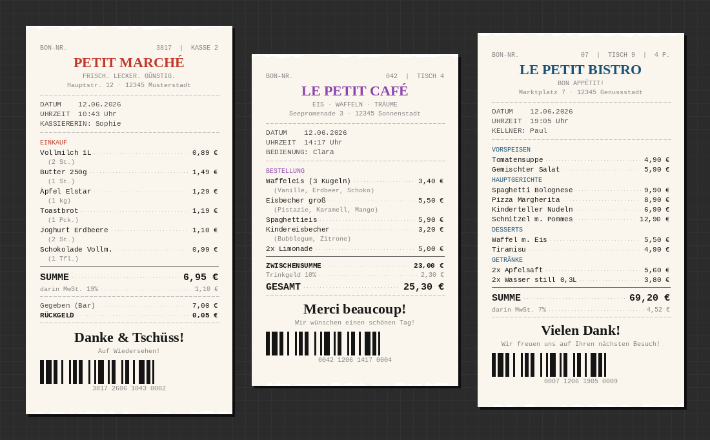

# LePetitCafe 🧾

**Ein Kassenbon-Drucker für Kinder** — drei bunte Knöpfe, drei Spielwelten, echter Thermodruck. Kein PC, kein Tablet, kein Bildschirm nötig.

Ein Knopfdruck → sofort kommt ein echter, zufällig generierter Kassenbon aus dem Drucker. Perfekt für Supermarkt, Eiscafé und Restaurant-Rollenspiele.



---

## Simulator (kein Hardware nötig)

Bons ausprobieren bevor du Hardware kaufst — direkt im Browser:

```bash
git clone https://github.com/nuenni/lepetitcafe.git
cd lepetitcafe
python3 simulate_web.py
```

Öffnet automatisch **http://localhost:5000** — drei Knöpfe, echter Bon-Look, jeder Klick ein anderer Bon.

> Port schon belegt? `python3 simulate_web.py 5001`

---

## Wie es funktioniert

```
Kind drückt Knopf
      │
      ▼
Raspberry Pi Zero 2 W
(läuft 24/7 im Hintergrund)
      │
      ▼  WiFi
Thermodrucker
      │
      ▼
Bon kommt raus 🎉
```

Der Pi startet beim Einschalten automatisch und wartet auf Knopfdrücke. Jeder Bon ist **einzigartig** — zufällige Artikel, Preise, Namen, Tischnummern und Datum/Uhrzeit.

---

## Die drei Spielwelten

| Knopf | Laden | Bon-Inhalt |
|-------|-------|-----------|
| 🔴 Rot | **PETIT MARCHÉ** (Supermarkt) | Lebensmittel, Kassierer-Name, Rückgeld-Berechnung |
| 🟣 Lila | **LE PETIT CAFÉ** (Eiscafé) | Eiskugeln mit Sorten, Tischnr., Bedienung, Trinkgeld |
| 🔵 Blau | **LE PETIT BISTRO** (Restaurant) | Vorspeisen/Hauptgang/Desserts/Getränke, Kellner, MwSt |

---

## Hardware

### Was du brauchst

| Teil | Empfehlung | Preis ca. |
|------|-----------|-----------|
| [WLAN-Thermodrucker](#drucker) | MUNBYN ITPP047 (80 mm, WiFi) | 60–75 € |
| Einplatinen-Computer | Raspberry Pi Zero 2 W | 28–35 € |
| SD-Karte | 16 GB microSD Class 10 (oder schneller) | 8–12 € |
| Arcade-Knöpfe | BerryBase 60 mm LED-Großknöpfe, 3 Farben | 3× ~4 € |
| Netzteil | 5 V / 2,5 A Micro-USB | 10–15 € |
| Gehäuse | Holzbox, Lunchbox oder 3D-Druck | – |

**Gesamtkosten: ca. 120–150 €**

---

### Drucker

Der Code nutzt das **ESC/POS**-Protokoll, das von nahezu allen günstigen Thermodruckern unterstützt wird. Der Drucker muss per **WLAN im selben Heimnetz** wie der Raspberry Pi erreichbar sein (TCP-Port 9100).

#### Empfohlene Modelle

**MUNBYN ITPP047** *(empfohlen, ~60–75 €)*
- 80 mm Papierbreite, 230 mm/s, Auto-Cutter
- WiFi + Ethernet + USB, ESC/POS-kompatibel
- Gut dokumentiert für Raspberry-Pi-Projekte, zuverlässige Community-Unterstützung
- Suche auf Amazon.de: `MUNBYN ITPP047 Thermodrucker`

**Xprinter XP-Q80I / XP-N160II** *(Alternative, ~50–75 €)*
- 80 mm, WiFi-Variante erhältlich
- Weit verbreitet in der Maker-Community, gute Linux-Kompatibilität
- Suche auf Amazon.de: `Xprinter WiFi Thermodrucker`

**NETUM NT-5890K** *(Budget-Option, ~40–55 €)*
- 58 mm Papierbreite (etwas schmalere Bons)
- WiFi + USB, ESC/POS-kompatibel
- Sehr kompakt und günstig
- Suche auf Amazon.de: `NETUM WiFi Thermodrucker`

> **Nicht kompatibel ohne Anpassung:** Drucker mit nur USB-Anschluss benötigen eine andere Verbindungsmethode (USB direkt am Pi — dann `config.py` entsprechend anpassen).

> **Tipp Papierrolle:** Standard 80 mm × 80 mm Thermopapierrollen, erhältlich im 10er-Pack für ca. 10 €.

---

### Raspberry Pi Zero 2 W

Der **Pi Zero 2 W** ist die ideale Wahl: klein, günstig, stromsparend und mit eingebautem WLAN.

| | Pi Zero 2 W *(empfohlen)* | Pi Zero W *(Budget)* |
|--|--|--|
| Preis | ~20–29 € | ~15–20 € |
| CPU | Quad-Core 1 GHz | Single-Core 1 GHz |
| RAM | 512 MB | 512 MB |
| WLAN | ✓ | ✓ |
| Eignung | Sehr gut | Ausreichend |

**Bezugsquellen in Deutschland:**
- [Berrybase.de](https://www.berrybase.de) — oft günstigste Preise, schnelle Lieferung
- Amazon.de — Suchbegriff: `Raspberry Pi Zero 2 W`
- Reichelt.de / Farnell Deutschland — solide Alternativen

---

### Arcade-Knöpfe

**60 mm LED-beleuchtete Arcade-Knöpfe** — groß genug für Kinderhände, robust und bunt.

**Empfehlung: BerryBase „Large Arcade Button 60mm beleuchtet LED 12V DC"**
- ~3,60–5,00 € pro Knopf, verfügbar in Rot, Blau, Gelb, Grün, Weiß
- Lieferung aus Deutschland (1–3 Werktage)
- Suche auf berrybase.de: `Large Arcade Button 60mm`

**Alternative: Arcade Express (arcadexpress.com/de)**
- Ähnliche 60 mm Konvex-Knöpfe mit Mikroschalter, gute Qualität

**Alternative: Amazon.de**
- Suche: `60mm Arcade Knöpfe LED farbig` — Marken EG STARTS, uxcell, BQLZR

> **Hinweis zur LED:** Die LED läuft mit 12 V DC. Für die reine Knopf-Funktion (Schaltung zur GPIO-Masse) reicht der Anschluss ohne LED völlig aus — kein 12V-Netzteil nötig.

---

### Netzteil

Ein offizielles oder hochwertiges Netzteil verhindert Abstürze durch Spannungseinbrüche.

- **Offizielles Raspberry Pi Netzteil** 5 V / 2,5 A Micro-USB — zuverlässigste Wahl (~15 €)
- **iUniker 5 V / 3 A** mit Ein-/Ausschalter — praktisch (~12 €)
- **LEICKE 5 V / 2,5 A** — günstige solide Alternative (~10 €)
- Suche auf Amazon.de: `Raspberry Pi Zero Netzteil Micro USB 5V`

---

## Verdrahtung

```
Raspberry Pi Zero 2 W  — GPIO (BCM-Nummerierung)

  ┌─────────────────────────────────┐
  │  [GPIO 17] ──────── [Knopf ROT  (Supermarkt) ] ──── [GND]  │
  │  [GPIO 27] ──────── [Knopf LILA (Eiscafé)    ] ──── [GND]  │
  │  [GPIO 22] ──────── [Knopf BLAU (Restaurant) ] ──── [GND]  │
  └─────────────────────────────────┘
```

Die internen **Pull-up-Widerstände** des Pi sind aktiviert. Jeder Knopf verbindet beim Drücken den jeweiligen GPIO-Pin mit GND — keine externen Widerstände nötig.

**GPIO-Pinout des Pi Zero 2 W:**
```
                    3V3  [1]  [2]  5V
                  GPIO2  [3]  [4]  5V
                  GPIO3  [5]  [6]  GND ←── alle 3 Knöpfe hier (oder eigene GND-Pins)
                  GPIO4  [7]  [8]  GPIO14
                    GND  [9] [10]  GPIO15
    Knopf ROT → GPIO17 [11] [12]  GPIO18
   Knopf LILA → GPIO27 [13] [14]  GND
                GPIO22 [15] [16]  GPIO23
    Knopf BLAU  ↑
```

---

## Installation

### Schritt 1 — Raspberry Pi vorbereiten

1. [Raspberry Pi Imager](https://www.raspberrypi.com/software/) herunterladen
2. **Raspberry Pi OS Lite (64-bit)** auf SD-Karte flashen
3. Im Imager unter ⚙️ *Einstellungen*:
   - WLAN-Zugangsdaten eintragen
   - SSH aktivieren
   - Benutzername `pi` und Passwort vergeben
4. SD-Karte in den Pi, einschalten, kurz warten

### Schritt 2 — Per SSH verbinden

```bash
ssh pi@raspberrypi.local
# oder mit IP-Adresse:
ssh pi@192.168.x.x
```

### Schritt 3 — Repository klonen

```bash
git clone https://github.com/nuenni/lepetitcafe.git
cd lepetitcafe
```

### Schritt 4 — Konfiguration anpassen

```bash
nano config.py
```

Folgende Werte eintragen:

```python
PRINTER_IP  = "192.168.1.xxx"  # IP deines Druckers (im Router nachschauen)
PRINTER_PORT = 9100             # Standard — normalerweise nicht ändern

GPIO_SUPERMARKT  = 17  # GPIO-Pin des roten Knopfes
GPIO_EISCAFE     = 27  # GPIO-Pin des lila Knopfes
GPIO_RESTAURANT  = 22  # GPIO-Pin des blauen Knopfes
```

> **Drucker-IP herausfinden:** Drucker einschalten → an deinen Router (Fritzbox etc.) anmelden → unter *Heimnetz / Netzwerk* nach dem Drucker suchen. Oder am Drucker selbst einen Testdruck über den Drücken-beim-Einschalten-Trick auslösen — viele Drucker drucken dabei ihre IP aus.

### Schritt 5 — Setup ausführen

```bash
chmod +x setup.sh
./setup.sh
```

Das Skript installiert alle Abhängigkeiten und richtet den Autostart-Service ein.

### Schritt 6 — Starten und testen

```bash
sudo systemctl start lepetitcafe
sudo systemctl status lepetitcafe
```

**Knopf drücken → Bon kommt raus!** 🎉

Ab sofort startet LePetitCafe automatisch, sobald der Pi eingeschaltet wird.

---

## Projektstruktur

```
LePetitCafe/
├── main.py                 # Hauptprogramm: GPIO-Listener, Druck-Dispatcher
├── config.py               # ← Hier IP und GPIO-Pins eintragen
├── requirements.txt        # Python-Pakete (python-escpos, RPi.GPIO)
├── setup.sh                # Einmalige Einrichtung
├── lepetitcafe.service     # Systemd-Unit für Autostart
├── docs/
│   └── preview.png         # Bon-Vorschau
└── receipts/
    ├── supermarkt.py       # PETIT MARCHÉ — Supermarkt-Bon
    ├── eiscafe.py          # LE PETIT CAFÉ — Eiscafé-Bon
    └── restaurant.py       # LE PETIT BISTRO — Restaurant-Bon
```

---

## Bon-Inhalt im Detail

Jeder Bon ist anders — bei jedem Druck werden Artikel, Preise, Namen und Details neu zufällig ausgewählt.

### 🛒 PETIT MARCHÉ (Supermarkt)
- 4–9 zufällige Lebensmittel aus ~30 Produkten
- Kassiererin/Kassierer-Name
- Bon-Nummer, Kassen-Nummer
- Datum und Uhrzeit
- MwSt.-Ausweisung (19 %)
- Gegeben/Rückgeld-Berechnung

### 🍦 LE PETIT CAFÉ (Eiscafé)
- Eiskugeln mit zufälligen Sorten aus 15 Geschmacksrichtungen
- Waffeln, Eisbecher, Shakes, Affogato, Getränke
- Tischnummer, Bedienung
- Optionales Trinkgeld (0, 5 oder 10 %)

### 🍽️ LE PETIT BISTRO (Restaurant)
- Kategorien: Vorspeisen, Hauptgerichte, Desserts, Getränke
- Tischnummer, Personenanzahl, Kellner/in
- MwSt. 7 % (Gastronomie-Satz)
- Jeweils passende Anzahl Gerichte für die Gästeanzahl

---

## Fehlersuche

```bash
# Live-Log des Services anzeigen
journalctl -u lepetitcafe -f

# Service neu starten
sudo systemctl restart lepetitcafe

# Drucker manuell testen
python3 -c "
from escpos.printer import Network
p = Network('192.168.1.xxx')  # IP anpassen
p.text('Hallo von LePetitCafe!\n')
p.cut()
p.close()
print('Druck erfolgreich!')
"

# GPIO-Knöpfe testen (ohne Drucker)
python3 -c "
import RPi.GPIO as GPIO, time
GPIO.setmode(GPIO.BCM)
GPIO.setup(17, GPIO.IN, pull_up_down=GPIO.PUD_UP)
print('Drücke den Supermarkt-Knopf...')
while True:
    if GPIO.input(17) == 0:
        print('Knopf gedrückt!')
    time.sleep(0.1)
"
```

### Häufige Probleme

| Problem | Lösung |
|---------|--------|
| Drucker nicht erreichbar | IP in `config.py` prüfen; Drucker und Pi im selben WLAN? |
| Knopf reagiert nicht | GPIO-Pin-Nummer in `config.py` prüfen; Verkabelung prüfen |
| Service startet nicht | `journalctl -u lepetitcafe` für Details; Python-Pfad korrekt? |
| Bon bricht mittendrin ab | Thermodrucker-Puffer voll? `DEBOUNCE_SECONDS` in `config.py` erhöhen |

---

## Gehäuse-Ideen

- **Holzbox** aus dem Baumarkt: Loch für Drucker oben, drei Löcher für Knöpfe vorne, Netzteil hinten
- **IKEA MOPPE** (Mini-Schubladenbox): Schubladen als Warenkorb, Knöpfe oben
- **3D-Druck**: Dateien für eine passende Box können gern als PR beigetragen werden!
- **Lunchbox aus Metall**: Stabil, günstig, mit Scharnierdeckel als Kassenlade

---

## Mitmachen / Contributing

Pull Requests sind herzlich willkommen! Ideen:

- 🌍 Weitere Sprachen (Französisch, Englisch, Spanisch...)
- 🏪 Neue Spielwelten (Bäckerei, Apotheke, Tankstelle...)
- 🛠️ Support für USB-Drucker
- 📦 Gehäuse-Designs (3D-Druck STL-Dateien)
- 🧪 Unit-Tests für die Bon-Generatoren

---

## Lizenz

MIT — frei verwendbar, veränderbar und weitergeben. Viel Spaß beim Nachbauen!

---

*Inspiriert von [claude-receipts](https://github.com/chrishutchinson/claude-receipts) von Chris Hutchinson.*
